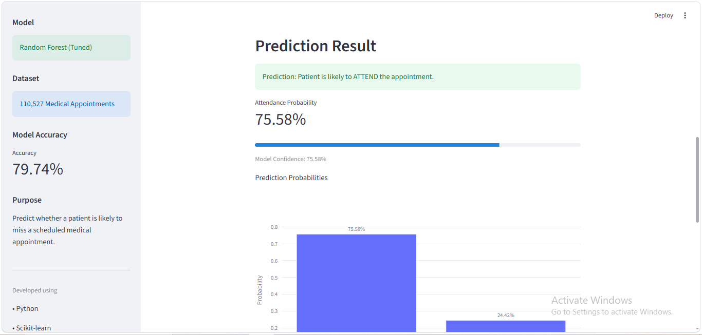
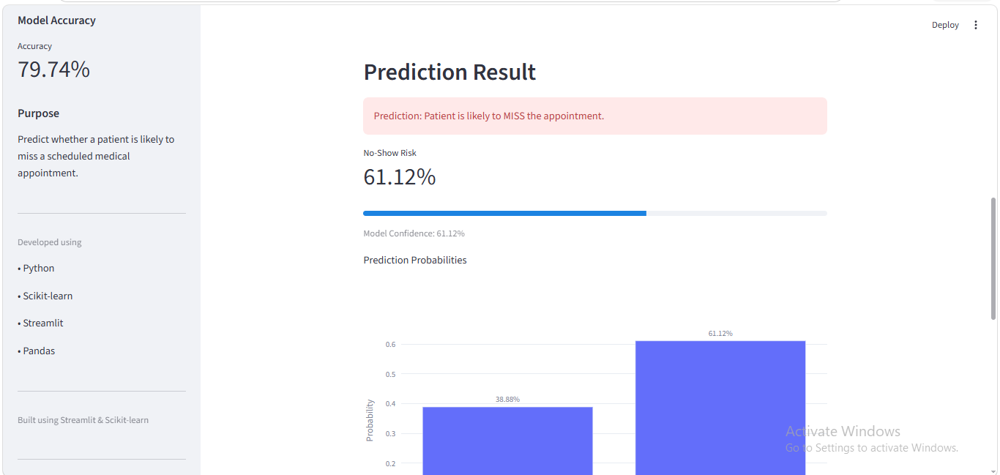
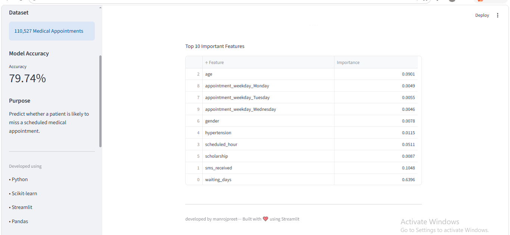

#  Medical Appointment No-Show Prediction

##  Project Overview

Missed medical appointments (No-Shows) create challenges for healthcare providers by increasing waiting times, wasting medical resources, and reducing operational efficiency. This project uses Machine Learning to predict whether a patient is likely to miss a scheduled appointment based on demographic, medical, and appointment-related information.

A **Random Forest Classifier** was trained, evaluated, and deployed through a **Streamlit web application**, allowing users to enter patient information and receive real-time predictions.

---

##  Problem Statement

Healthcare providers frequently face appointment no-shows, which lead to:

1. Wasted appointment slots
2. Increased healthcare costs
3. Longer waiting lists
4. Reduced hospital efficiency

The objective of this project is to predict whether a patient will attend or miss a scheduled appointment so hospitals can take preventive actions such as sending reminders or rescheduling appointments.

---

## Dataset

1. **Dataset: **Medical Appointment No-Show Dataset
2. Total Records: 110,527
3. Type: Binary Classification

### Features Used

* Gender
* Age
* Scholarship
* Hypertension
* Diabetes
* Alcoholism
* Handicap
* SMS Received
* Waiting Days
* Scheduled Hour
* Appointment Weekday
* Neighbourhood

**Target Variable**

* No-Show (Attend / Miss Appointment)

---

## Project Workflow

1. Data Collection
2. Exploratory Data Analysis (EDA)
3. Data Cleaning
4. Feature Engineering
5. Data Preprocessing
6. Model Training
7. Hyperparameter Tuning
8. Model Evaluation
9. Feature Importance Analysis
10. Model Serialization using Joblib
11. Streamlit Deployment

---

##  Technologies Used

* Python
* Pandas
* NumPy
* Scikit-learn
* Seaborn
* Plotly
* Streamlit
* Joblib
* JupyterLab

---

##  Machine Learning Model

Several classification algorithms were explored, and the final deployed model is:

**Random Forest Classifier (Hyperparameter Tuned using GridSearchCV)**

The model was evaluated using:

* Accuracy
* Precision
* Recall
* F1-Score
* Confusion Matrix

Special attention was given to precision and recall because the dataset is imbalanced, making accuracy alone insufficient for evaluating performance.

---

## Deployment

The trained model was saved using **Joblib** and deployed with **Streamlit**.

The application allows users to:

* Enter patient information
* Predict appointment attendance
* View prediction probabilities
* Display feature importance
* Provide an interactive user interface for real-time predictions

---

##  Project Structure

```text
medical-appointment-noshow-prediction/
│
├── app/
│   └── app.py
│
├── assets/
│   ├── home.png
│   ├── attend_prediction.png
│   ├── no_show_prediction.png
│   └── feature_importance.png
│
├── data/
│   ├── raw/
│   │   └── dataset.csv
│   └── processed/
│       └── cleaned_medical_appointments.csv
│
├── models/
│   ├── medical_no_show_model.pkl
│   ├── feature_columns.pkl
│   └── feature_importance.csv
│
├── notebooks/
│   ├── 1.data_understanding.ipynb
│   ├── 2.data_cleaning_preprocessing.ipynb
│   ├── 3.EDA.ipynb
│   ├── 4.Model_Training.ipynb
│   └── 5.Prediction.ipynb
│
├── src/
│   └── preprocessing.py
│
├── requirements.txt
├── README.md
└── .gitignore
```

---

##  How to Run

1. Clone the repository.

2. Install dependencies.

```bash
pip install -r requirements.txt
```

3. Start the Streamlit application.

```bash
streamlit run app/app.py
```

---

## Future Improvements

* Improve recall for minority class predictions.
* Experiment with XGBoost and LightGBM.
* Build a REST API using FastAPI.
* Deploy the application to the cloud.
* Add patient authentication and database integration.

---

## Application Screenshots

### Home Page


### Attend Prediction


### No-Show Prediction


### Feature Importance


##  Author

**Manrojpreet**

Medical appointment no show prediction Project

Developed using Python, Scikit-learn, and Streamlit.